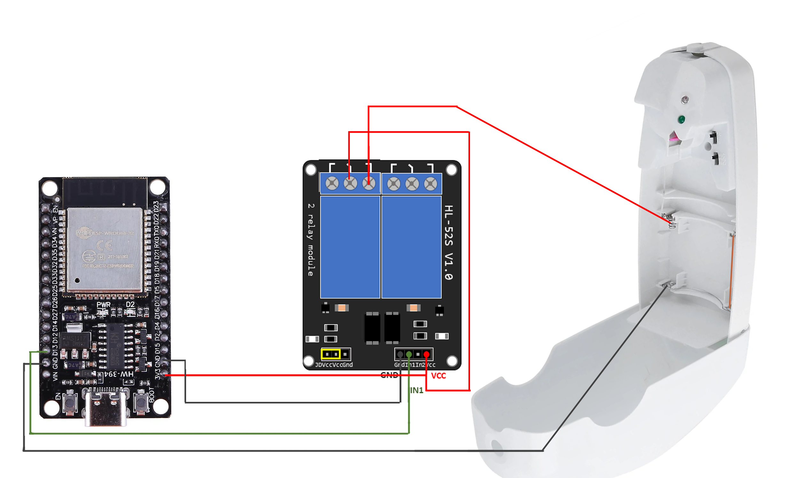

# esp32-airwick-homeassistant
Making the Airwick spray smart with ESP32 and connecting it to Home Assistant.

## Guideline
I wanted to automate my Airwick sprayer and connect it to Home Assistant to make it smarter.

## Why?
- Because the AA batteries always die, and I don't know it until I manually check.
- Because without automation, it sprays every 5, 18, or 36 minutes, even at night or when we're not home.
- Now i have one USB-C Port to power the esp32 and the airwick.

## Smart Automation
Now I can toggle the automation at specific times, and I can set conditions to ensure that either my wife or I are home; otherwise, the spray automation does not start.

## Scheme

## Yaml
- Esp32 Yaml code is [Here](esp32.yaml)
- Automation Yaml code is [Here](automation.yaml)
